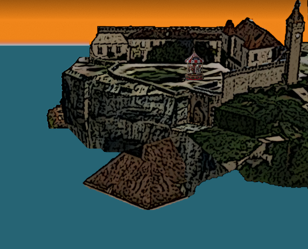

# RocamadourPlage

by Sébastien Abilla

GNU/GPL v3 (voir LICENSE)

[aperçu vidéo](https://youtu.be/z6CePmCaHIM)

#### Play online:

[itch.io]https://seb46.itch.io/rocamadour-plage

#### Description:

* Ramène les bons trésors à ta dulcinée.
* Contrôle: Pavé directionnel ou Joystick (pas de bouton)
* Réalisé pour la One Minute Game jam #7 en aôut 2022, thème: Under_Water et légèrement amélioré ensuite ([Devlog](https://seb46.itch.io/rocamadour-plage/devlog/413269/jeu-soumis-mais-pas-fini))
* Outils de création: Godot 3.4, GIMP 2.10, Firefox 103 sous Xubuntu22.04

[Code source](https://github.com/sebabilla/RocamadourPlage)

#### Credits

* Effets sonores adaptés de sons de [LaSonothèque](https://lasonotheque.org/apropos.html) of Joseph Sardin (Free of right)
* Musique découpée dans Julia Florida de Agustin Barrios Mangore interprété par Edson Lopes distribué sous licence [CC-by-3.0](https://creativecommons.org/licenses/by/3.0/)
* Image de fond réalisée à partir d'une vue de Rocamadour dans la version desktop de [Google Earth](https://www.google.fr/intl/fr/earth/).